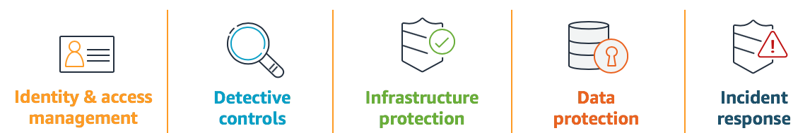

# Security Labs

## Introduction
This repository contains documentation and code in the format of hands-on labs to help you learn, measure, and build using architectural best practices. The labs are categorized into levels, where 100 is introductory, 200/300 is intermediate and 400 is advanced.

For more information about security on AWS visit [AWS Security](https://aws.amazon.com/security/) and read the [AWS Well-Architected Security whitepaper](https://d1.awsstatic.com/whitepapers/architecture/AWS-Security-Pillar.pdf) or online [https://wa.aws.amazon.com/](https://wa.aws.amazon.com/). Also check out [https://awssecworkshops.com/](https://awssecworkshops.com/) for hands-on workshops, [AWS Training and Certification Learning Library](https://www.aws.training/LearningLibrary?filters=classification%3A27&search=&tab=digital_courses%3Ftc%3Dicon) for official security training options.

## Labs
* [Level 100: AWS Account and Root User](100_Troubleshoot_KMS_Key_Policy/README.md)
